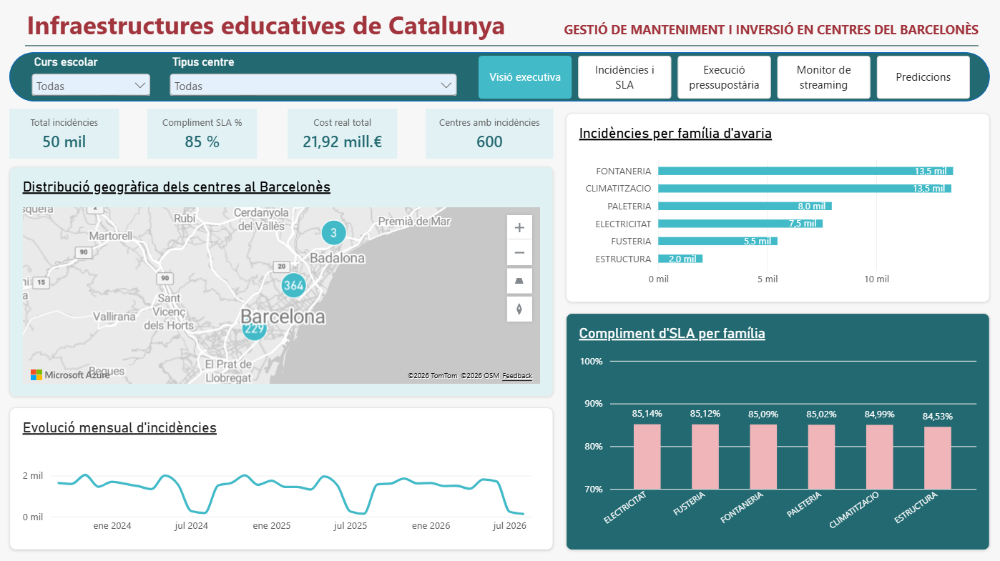
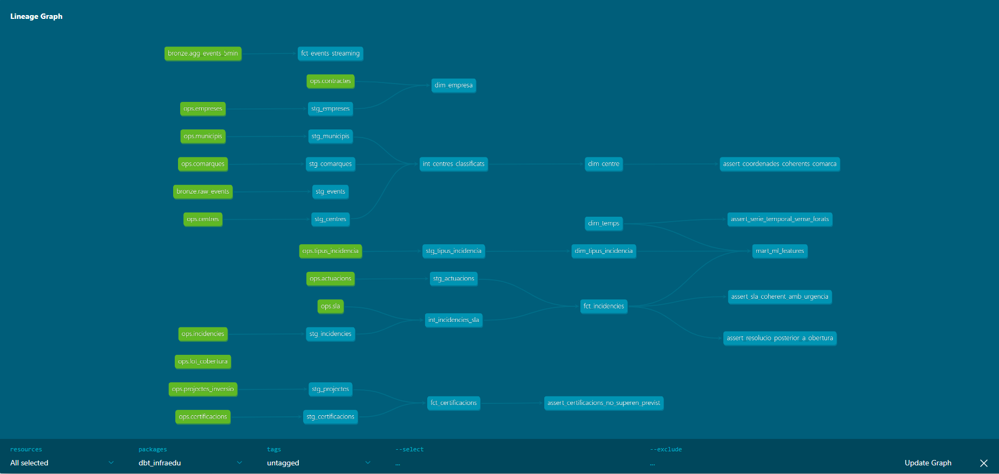
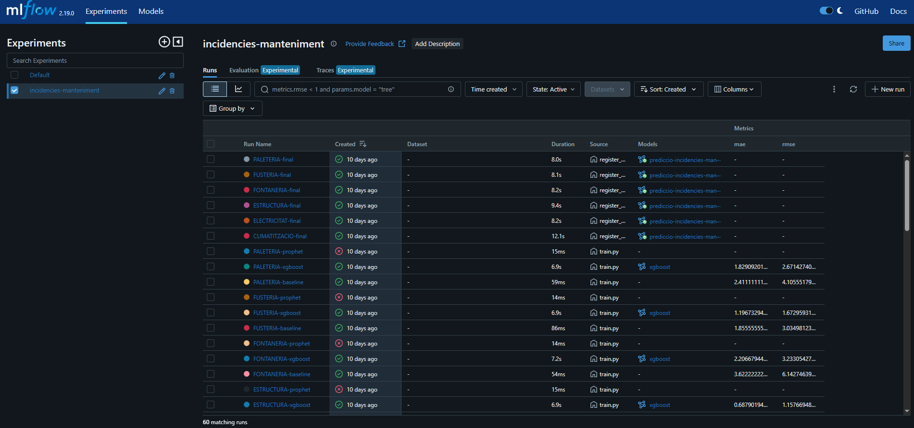
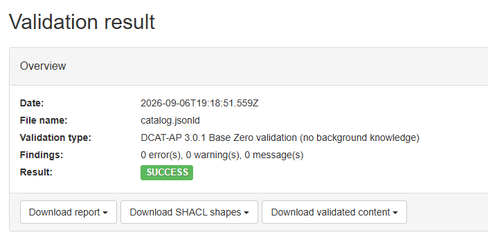

# PR3 · Plataforma de dades d'infraestructures educatives de Catalunya

Simulació d'un sistema de gestió de manteniment i inversió en centres
educatius, construït com a projecte de portfolio de data engineering.
Cobreix el cicle complet: ingesta en temps real, capa operacional,
transformació analítica, model predictiu, visualització i publicació
com a dades obertes.

**[Dashboard interactiu](https://app.powerbi.com/view?r=eyJrIjoiYzI1OThmNzgtNmU4Ni00MDhiLThhNTYtOTEwZjYxNDkwMmNjIiwidCI6IjE2MDMzYWMxLTJiNWMtNDMzMC1hYjM1LTM3YTY5OGIyZmQ0MSIsImMiOjl9)** ·
**[Portfolio](https://karimgp.com/)**



---

## Arquitectura

```
Productor Python ──► Kafka ──► Flink ──► PostgreSQL (bronze)
                                              │
                                   PostgreSQL (ops · OLTP)
                                              │
                                   dbt (staging → marts)
                                    │                  │
                          Power BI ◄┘                  └► XGBoost + MLflow
                              │                                  │
                         Neon (núvol)                  ml.prediccions
                                              │
                                     Catàleg DCAT-AP
```

Sis serveis a Docker Compose: PostgreSQL, Zookeeper, Kafka, Kafka UI i
un clúster Flink (JobManager + TaskManager).

---

## Stack

| Capa | Tecnologia |
|---|---|
| Ingesta en temps real | Apache Kafka 3.6 |
| Processament de flux | Apache Flink 1.18 (PyFlink) |
| Base operacional | PostgreSQL 16 |
| Transformació | dbt 1.8 (dbt-postgres) |
| Machine learning | XGBoost + MLflow |
| Visualització | Power BI |
| Publicació | Neon (PostgreSQL al núvol) · DCAT-AP 3.0.1 |
| Orquestració local | Docker Compose |

---

## Dades: què és real i què és simulat

Aquesta distinció es manté explícita a tot el projecte.

**Reals.** Directori de centres docents de la Generalitat de Catalunya
([Transparència Catalunya](https://analisi.transparenciacatalunya.cat/Educaci-/Directori-de-centres-docents-anual-Base-2020/kvmv-ahh4),
dataset `kvmv-ahh4`, curs 2025/2026): 5.434 centres amb ubicació,
coordenades, titularitat i ensenyaments autoritzats, més 734 municipis
i 43 comarques.

**Simulades.** Tota la capa transaccional: 50.000 incidències de
manteniment, 58.932 actuacions, 150 projectes d'inversió amb les seves
certificacions, i els atributs de mida i antiguitat dels centres.

Els patrons de la simulació no són arbitraris: provenen d'experiència
operativa real en manteniment d'infraestructures educatives.

| Paràmetre | Valor |
|---|---|
| Volum | ~28 incidències per centre i any, proporcional a la mida |
| Famílies | Fontaneria 27%, climatització 27%, paleteria 16%, electricitat 15%, fusteria 11%, estructura 4% |
| Estacionalitat | Només climatització: pics al novembre i al maig, quan s'arrenquen els sistemes |
| Calendari escolar | Juliol i agost gairebé sense activitat |
| Antiguitat | Efecte feble: un centre dels anys 60 genera un ~30% més que un del 2015 |
| SLA | 24 h si afecta la seguretat o interromp l'activitat docent; 120 h la resta |
| Resolució provisional | El 50% de les urgents necessiten una segona intervenció |

L'àmbit de la simulació s'acota al **Barcelonès** (600 centres) perquè
els contractes marc de manteniment s'adjudiquen per lots territorials.
El catàleg de centres, en canvi, és complet.

El generador va amb llavor fixa: dues execucions produeixen exactament
les mateixes dades.

---

## Model de dades

Tres esquemes amb responsabilitats separades:

| Esquema | Contingut |
|---|---|
| `ops` | Capa transaccional (OLTP), normalitzada |
| `bronze` | Aterratge cru del stream de Kafka, amb metadades de procedència |
| `meta` | Catàleg DCAT dels datasets publicables |

dbt hi afegeix `dbt_staging` i `dbt_marts`.

En un entorn de producció, dbt operaria sobre un DW separat per no
impactar el rendiment de la base de dades transaccional. En aquest
projecte s'ha unificat en una sola instància de PostgreSQL per
simplicitat operativa, mantenint la separació lògica mitjançant
esquemes. L'usuari `powerbi_ro` només té permisos de lectura i les
càrregues analítiques no escriuen mai als esquemes operacionals.

### Llinatge



19 models: 10 de staging (vistes), 2 intermediate i 7 marts en esquema
en estrella (4 dimensions, 3 taules de fets).

### Qualitat

**88 tests**, tots verds excepte un avís deliberat.

- 83 genèrics: `unique`, `not_null`, `relationships`, `accepted_values`
- 4 singulars de regles de negoci: coherència temporal de les
  resolucions, certificacions dins del marge previst, continuïtat de la
  sèrie temporal, coherència entre SLA i urgència
- 1 de qualitat de la font: detecta centres geolocalitzats lluny del
  centroide de la seva comarca. Configurat com a avís, no error: és un
  defecte de la font (3 centres sobre 5.434), no del pipeline

---

## Model predictiu

Prediu el volum diari d'incidències per família d'avaria.



**Metodologia.** Baseline naïf primer (valor de fa 7 dies) com a
referència obligatòria. Split temporal de 90 dies, mai aleatori: un
split aleatori filtraria futur al passat i inflaria les mètriques.

**Resultats.** XGBoost bat la baseline a les sis famílies:

| Família | MAE baseline | MAE XGBoost | Millora |
|---|---|---|---|
| Climatització | 3,14 | 1,60 | **49,3%** |
| Fontaneria | 3,62 | 2,21 | 39,1% |
| Fusteria | 1,86 | 1,20 | 35,5% |
| Paleteria | 2,41 | 1,83 | 24,1% |
| Electricitat | 2,11 | 1,75 | 17,3% |
| Estructura | 0,77 | 0,69 | 10,3% |

La climatització és on més guanya, precisament la família amb
l'estacionalitat més marcada. I `es_periode_lectiu` resulta ser la
variable més important a cinc de sis famílies: el model ha après el
calendari escolar pel seu compte.

La predicció és recursiva (cada dia s'alimenta de la predicció
anterior), de manera que l'error s'acumula amb l'horitzó. Per això es
limita a 30 dies.

---

## Catàleg de dades obertes



El projecte publica quatre datasets amb metadades **DCAT-AP 3.0.1** en
JSON-LD, fent servir els vocabularis controlats de la UE (data-theme,
frequency, IANA media types). Validat amb el
[validador SHACL de SEMIC](https://www.itb.ec.europa.eu/shacl/dcat-ap/upload)
de la Comissió Europea: **0 errors, 0 avisos**.

Les distribucions són reals i es poden descarregar de
[`data/public/`](data/public/), en CSV i Parquet. El Parquet ocupa un
63% menys amb les mateixes dades.

---

## Posada en marxa

Requisits: Docker Desktop i Python 3.11.

```bash
cp .env.example .env
docker compose up -d postgres          # crea l'esquema automàticament

python -m venv .venv && source .venv/Scripts/activate
pip install -r requirements.txt

python scripts/load_referencia.py      # 5.434 centres reals
python scripts/seed_tipus.py           # catàleg de tipus d'avaria
python scripts/generate_synthetic.py   # capa transaccional
```

### Streaming

```bash
docker compose build flink-jobmanager
docker compose up -d
docker exec pr3-kafka kafka-topics --create --topic infraedu.events \
  --bootstrap-server localhost:29092 --partitions 3 --replication-factor 1

python producer/simulator.py --mode burst --events 20000
./scripts/run_flink_job.sh 02_kafka_to_bronze.py
./scripts/run_flink_job.sh 03_windowed_agg.py
```

Interfícies: Flink a `localhost:8082`, Kafka UI a `localhost:8081`.

### Transformació i model

```bash
cd dbt_infraedu && dbt run && dbt test && dbt docs generate
cd .. && python ml/train.py && python ml/register_and_predict.py
python scripts/seed_dcat.py && python scripts/generate_dcat.py
```

---

## Decisions d'arquitectura

**Versions congelades des del principi.** Flink 1.18.1 amb
`flink-sql-connector-kafka:3.1.0-1.18`, `flink-connector-jdbc:3.1.2-1.18`
i el driver `postgresql-42.7.3`. Les incompatibilitats entre Flink i
els seus connectors només apareixen en temps d'execució, amb errors
que no assenyalen la causa.

**Prova de foc el primer dia.** Abans de construir res, un job mínim
amb el connector `datagen` (sense Kafka) va validar que Flink podia
escriure a PostgreSQL. Aïllar la peça de més risc va permetre que els
errors posteriors tinguessin una sola causa possible.

**Event time, no processing time.** Les finestres d'agregació de Flink
s'assignen segons quan va passar l'esdeveniment, no quan es processa.
Això fa que reprocessar el topic doni resultats idèntics.

**Bronze no transforma.** El payload es guarda sencer en JSONB amb les
metadades de Kafka (topic, partició, offset). Si el productor afegeix
un camp, no es perd res ni cal tocar l'esquema.

**L'SLA es mesura contra el restabliment del servei**, no contra la
reparació definitiva. Una avaria de calefacció al gener es tapa en 24 h
i es repara de veritat setmanes després; mesurar-ho contra la
definitiva donaria un incompliment massiu i fals.

**Les incidències obertes no compten per al compliment.** `compleix_sla`
val NULL, no FALSE: encara no han incomplert res, i comptar-les com a
incompliment inflaria la mètrica.

**La classificació de centres va a dbt, no a l'esquema.** La font dona
banderes d'ensenyament independents, no un camp de tipus. La regla de
classificació viu en un sol lloc, documentada i testada.

---

## Limitacions conegudes

**L'agregació de Flink barreja magnituds.** `bronze.agg_events_5min`
agrupa per tipus d'esdeveniment però no per magnitud, de manera que
`valor_mitja` i `valor_max` combinen temperatures, consums i CO₂. La
mesura fiable és `num_events`. Es va deixar així conscientment: el
propòsit del job era demostrar computació amb estat sobre un stream.

**Prophet no s'executa en aquest entorn.** La comparació inicial
preveia Prophet i XGBoost. Prophet falla en carregar el backend Stan de
`cmdstanpy` a Windows 10 (`AttributeError: stan_backend`); es van
descartar la instal·lació incompleta, els binaris absents i la ruta amb
espais com a causes. Es va decidir no dedicar-hi més temps: la
comparació XGBoost contra baseline ja demostra el que ha de demostrar,
i la comparació Prophet/XGBoost està feta al projecte PR2.

**Tres centres mal geolocalitzats a la font.** Detectats mirant un mapa
que no quadrava. El test `assert_coordenades_coherents_comarca` els fa
visibles; el dashboard els exclou amb un filtre de rang.

**L'antiguitat dels centres és uniforme entre tipus.** Artefacte del
generador: assigna l'any de construcció sense mirar el tipus de centre.
A la realitat, les llars d'infants serien més noves.

---

## Estructura

```
├── docker-compose.yml          Sis serveis
├── docker/flink/Dockerfile     Imatge Flink amb PyFlink i connectors
├── sql/                        Esquema PostgreSQL (17 taules)
├── scripts/                    Càrrega de dades, migració i DCAT
├── producer/                   Productor d'esdeveniments Kafka
├── flink_jobs/                 Jobs PyFlink
├── dbt_infraedu/               Projecte dbt (19 models, 88 tests)
├── ml/                         Entrenament i prediccions
├── powerbi/                    Dashboard (.pbix)
├── data/public/                Distribucions DCAT (CSV i Parquet)
└── docs/                       Catàleg DCAT, diagrames i captures
```

---

## Llicència

Codi sota llicència MIT. Les dades de centres docents provenen del
portal de dades obertes de la Generalitat de Catalunya, sota la seva
llicència d'ús.
